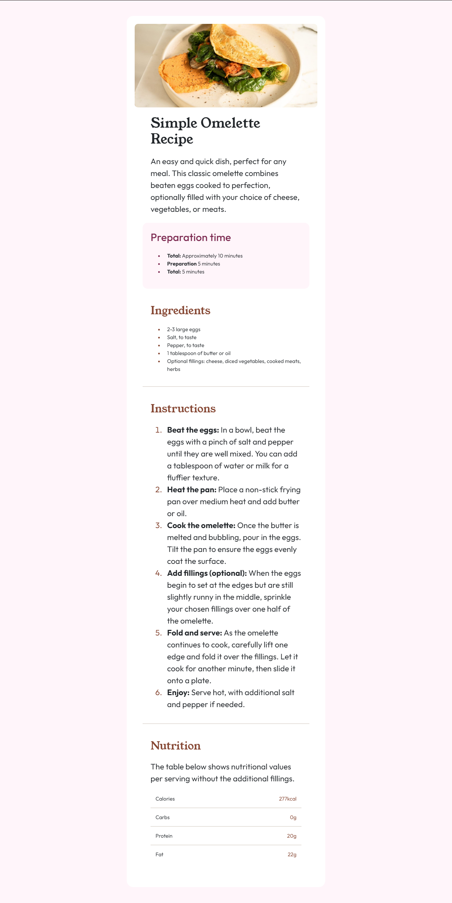

# Frontend Mentor - Recipe page solution

This is a solution to the [Recipe page challenge on Frontend Mentor](https://www.frontendmentor.io/challenges/recipe-page-KiTsR8QQKm). Frontend Mentor challenges help you improve your coding skills by building realistic projects.

## Table of contents

- [Overview](#overview)
  - [Screenshot](#screenshot)
  - [Links](#links)
- [My process](#my-process)
  - [Built with](#built-with)
  - [What I learned](#what-i-learned)
- [Author](#author)

**Note: Delete this note and update the table of contents based on what sections you keep.**

## Overview

### Screenshot

### Links

- Solution URL: [Add solution URL here](https://your-solution-url.com)

## My process

### Built with

- Semantic HTML5 markup
- CSS custom properties
- Flexbox
- Mobile-first workflow
- [Boostrap](https://getbootstrap.com/) - For styles

### What I learned

During this challenge, I focused on creating a responsive recipe page, which taught me several valuable skills:

- Responsive Design: I enhanced my ability to make layouts adaptable across devices using CSS media queries.
- Semantic HTML: I learned the importance of using semantic tags for better accessibility and SEO.
- CSS Flexbox & Grid: I practiced using Flexbox and Grid to create effective and visually appealing layouts.
- Consistency in Styling: I emphasized maintaining a cohesive design through consistent use of typography and color schemes.
- Debugging: I improved my troubleshooting skills by resolving layout issues and refining styles.
  This challenge helped me reinforce my existing knowledge while pushing me to explore new techniques.

## Author

- Frontend Mentor - [@yourusername](https://www.frontendmentor.io/profile/Mannan-x)
